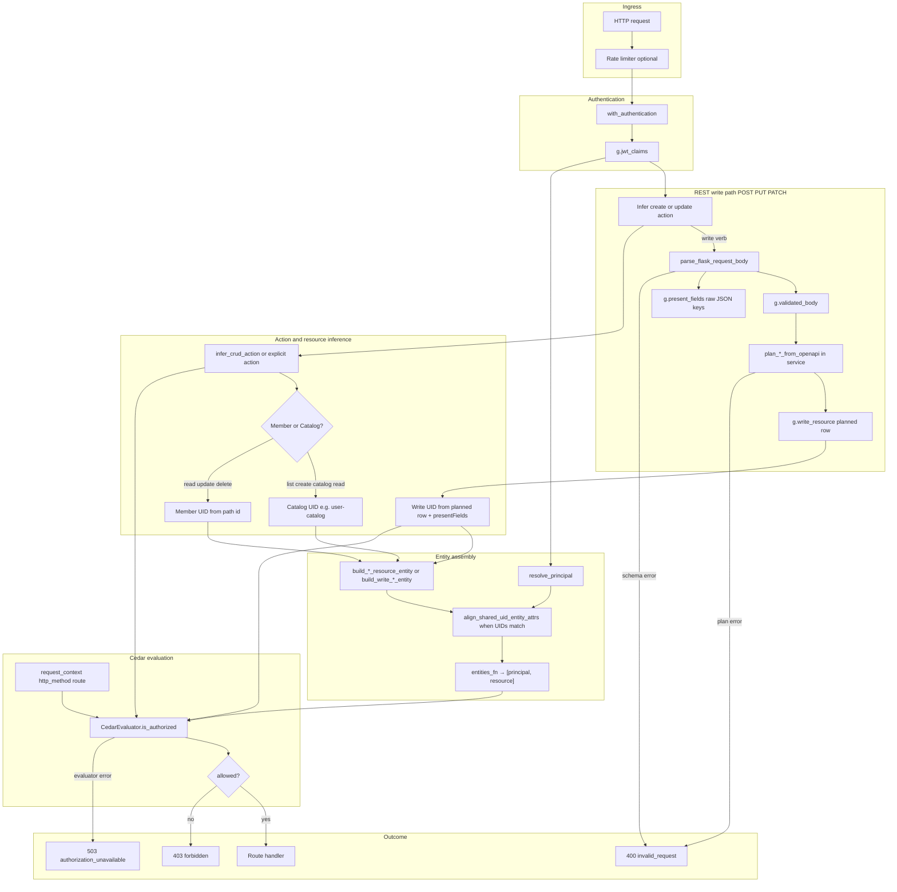

# authorization-in-the-middle

Shared Cedar authorization middleware for Neosofia platform services.

## Rosetta stone — REST, Cedar, and our words

Maps how we talk about APIs to what Cedar evaluates. Read top to bottom once; use the route table as the cheat sheet afterward.

### The authorization question

Every protected route answers one question:

```text
principal  +  action  +  resource
   who         what      on what
```

- **Principal** — who is acting. Almost always JWT **`sub`**, built in `resolve_principal()` (your service decides how: JWT claims, DB row, etc.). Not taken from the path.
- **Action** — what they want, e.g. `Action::"user:list"`. Inferred from HTTP method + path, or passed explicitly on `@with_security`.
- **Resource** — what they act on: one `User`, the `UserCatalog` for “list users,” a `Service`, etc.

Policies only see those three UIDs plus **entity records** (attributes for principal and resource). They do not see HTTP or JWT directly.

### Glossary

| Term | Meaning |
|------|---------|
| **Principal** | The actor (`users::User` / `authentication::User`). |
| **Action** | The verb (`user:read`, `user:list`, …). |
| **Resource** | The target of the action (`User`, `UserCatalog`, `Service`, …). |
| **Entity** | [Cedar](https://docs.cedarpolicy.com/overview/terminology.html) name for a typed object with an id and **attributes** (`uid`, `attrs`, `parents`). In our code: the JSON from `build_entity_payload()`. |
| **Member** | One record — id from the path (`user_uuid`, `slug`). |
| **Catalog** | REST **collection** (list/create) — Cedar type `*Catalog`, fixed id (`user-catalog`). Same as “the list endpoint,” not a product catalog. |

`entities_fn` returns **`[principal_entity, resource_entity]`** — attribute data for who and what. The action is separate.

### Cedar entity record (brief)

UID in policies: `users::User::"aaa-111"` (type + id).

Record passed to the evaluator ([syntax](https://docs.cedarpolicy.com/auth/entities-syntax.html)):

```json
{
  "uid": { "__entity": { "type": "users::User", "id": "aaa-111" } },
  "attrs": { "uuid": "aaa-111", "tenantId": "tenant-xyz", "isOperator": true },
  "parents": []
}
```

“Entity” in code means this object — principal and resource each get one; the action does not.

### REST routes → Cedar

Principal on every row = JWT **`sub`**.

| You say | Example HTTP | Cedar **action** | Cedar **resource** | Resource entity id |
|---------|--------------|------------------|-------------------|-------------------|
| **List** users (paginate, search) | `GET /api/v1/users` | `user:list` | `users::UserCatalog` | Fixed `user-catalog` |
| **Create** a user | `POST /api/v1/users` | `user:create` | `users::UserCatalog` | Fixed `user-catalog` |
| **Get** one user | `GET /api/v1/users/{user_uuid}` | `user:read` | `users::User` | Path `user_uuid` |
| **Replace** one user (full body) | `PUT /api/v1/users/{user_uuid}` | `user:update` | `users::User` | Path `user_uuid` |
| **Update** one user (partial) | `PATCH /api/v1/users/{user_uuid}` | `user:update` | `users::User` | Path `user_uuid` |
| **Delete** one user | `DELETE /api/v1/users/{user_uuid}` | `user:delete` | `users::User` | Path `user_uuid` |
| **Get** a user’s audit history | `GET /api/v1/users/{user_uuid}/audits` | `user:read` | `users::User` | Path `user_uuid` |
| **List** role picklists | `GET /api/v1/roles` | `role:list` | `users::RoleCatalog` | Fixed `role-catalog` |
| **Rotate** a service credential | `POST /api/services/{slug}/rotate` | `service:rotate` | `authentication::Service` | Path `slug` |

**Notes:** List/create target **`UserCatalog`** because the URL has no member id. **PUT** and **PATCH** often share `user:update`. **DELETE** is the usual REST shape — add `user:delete` to policy when you ship it (not on user v1).

Example — list users:

```text
principal  = users::User::"aaa-111"                 ← JWT sub
action     = Action::"user:list"
resource   = users::UserCatalog::"user-catalog"
```

### Request flow (`@with_security`)

Authn lives in `authentication-in-the-middle`; authz is this package + your `src.authorization.entities` + Cedar policies.



**Read path** (GET, DELETE without body planning): skips the write subgraph — infer action → load principal + member/catalog entity → Cedar → handler.

**Custom actions** (provision, rotate): pass `action=` (and usually `entities_fn` / `resource_fn`); set `validate_openapi=True` when the route still accepts JSON.

### Cedar helpers — what policies can use

Cedar evaluates **principal + action + resource** UIDs plus **entity records** and optional **request context**. It does not see HTTP or JWT directly — the SDK and your `src.authorization.entities` translate the request into attrs policies can reference.

#### Request context (`context_fn`)

| Attribute | Source | Example use |
|-----------|--------|-------------|
| `http_method` | `request_context()` | Rare; prefer action inference |
| `route` | Flask `url_rule.rule` | Debugging, route-specific rules |

#### Write payload intent (`presentFields`)

On REST **create** and **update**, the SDK attaches a sorted set of **raw JSON keys** (before defaults) to the resource entity:

| Attribute | Type | Set by | Example in Cedar |
|-----------|------|--------|------------------|
| `presentFields` | Set of String | `payload.present_field_names` + `_entities_for_write_member` | `!resource.presentFields.contains("roles")` |

When principal and resource share the same UID (self-update), `align_shared_uid_entity_attrs` merges `presentFields` into **both** records so cedarpy sees identical attrs.

#### Role slug namespaces (`roleNamespaces`)

When the client sends `roles` on a write, the SDK derives sorted unique namespace prefixes from full slugs (`cro.admin` → `cro`). Cedar `Set.contains` matches whole set elements — use `roleNamespaces` for prefix-style rules, not substring checks on `roles`.

| Attribute | Type | Set by | Example in Cedar |
|-----------|------|--------|------------------|
| `roleNamespaces` | Set of String | `write_role_namespace_attrs` when `roles` ∈ `presentFields` | `resource.roleNamespaces.contains("cro")` |

Requires `resource has roleNamespaces` in policy when the attribute may be absent on read paths.

#### Exact set fields (`rolesExact`, `{field}Exact`)

When the client sends a list field on a write (for example `roles`), the SDK can derive a canonical exact set so policies avoid `forbid` + `contains` smells. Use `write_exact_set_field_attrs` (or rely on `with_security` for `roles`).

| Attribute | Type | Set by | Example in Cedar |
|-----------|------|--------|------------------|
| `rolesExact` | Set of String | `write_exact_set_field_attrs` when `roles` ∈ `presentFields` | `resource.rolesExact == ["patient.self"]` |

Pass `allowed=[...]` to the helper to omit the attribute unless the payload matches exactly (policy: `resource has rolesExact`). Without `allowed`, the attribute is the canonical proposed set for equality checks in Cedar.

#### JWT → principal attrs (`flask_identity`)

`jwt_claim_principal_attributes` maps `neosofia:*` claims to Cedar names:

| JWT claim | Cedar attr | Notes |
|-----------|------------|-------|
| `sub` | `uuid` | Human `User` principals (not `token_type: service`) |
| `neosofia:principal_type` | entity type | `User`, `Service`, … |
| `neosofia:tenant_uuid` | `tenantId` | |
| `neosofia:tenant_type` | `tenantType` | e.g. `platform`, `site`, `cro` |
| `neosofia:session_actors` | `sessionActors` | |
| `neosofia:actors` | `actors` | Tier-1 actor list (JWT); narrowed by `X-Active-Actor` in authn |
| `neosofia:roles` | `roles` | Tier-2 short org roles within tenant type |
| `neosofia:token_type` | `tokenType` | `human` or `service` |
| other `neosofia:*` | same name after prefix | e.g. `neosofia:foo` → `foo` |

`extract_jwt_principal_entity` / `extract_jwt_principal_uid` build a principal from `g.jwt_claims`. Service ``entities`` modules should expose ``resolve_principal()`` as a thin wrapper around ``resolve_jwt_principal(namespace, actor_classes=…)`` — JWT-only, with optional tier-1 boolean flags when actor classes are configured.

#### Tier-1 actor flags (`cedar_attrs.tier1_actor_flags`)

From JWT `actors`, the SDK (or your domain module) sets booleans policies use instead of parsing lists:

| Cedar attr | When true |
|------------|-----------|
| `isOperator` | `operator` in JWT actors |
| `isStudy` | `study` in JWT actors |
| `isClinician` | `clinician` in JWT actors |
| `isPatient` | `patient` in JWT actors |

Actor class names come from your catalog (`actor_classes()` in user service); flag names are `is` + capitalized actor slug.

#### Entity record attrs (service-owned, typical user service)

Your `build_*_resource_entity` / `principal_cedar_attrs` supply row state. User service policies commonly reference:

| Attr | On | Meaning |
|------|-----|---------|
| `uuid` | principal, resource | Registry user id |
| `tenantId` | principal, resource | Org tenant UUID |
| `tenantType` | principal | From JWT (`platform`, `site`, `cro`, …) |
| `roles` | principal, resource | Tier-2 short roles on principal; full catalog slugs on resource |
| `tokenType` | principal, resource | `human` or `service` |
| `serviceSlug` | `users::Service` principal | e.g. `authentication` for provision |
| `presentFields` | resource (writes) | See above |
| `roleNamespaces` | resource (writes) | Namespace prefixes from proposed `roles` slugs |

Catalog resources may add scope attrs, e.g. `UserCatalog.tenantId` for tenant-scoped list.

#### Entity shape helpers (`entities`)

| Helper | Purpose |
|--------|---------|
| `entity_uid(type, id)` | Cedar UID string, e.g. `users::User::"uuid"` |
| `build_entity_payload(type, id, attrs, parents)` | Full evaluator entity dict |
| `build_catalog_entity(namespace, cedar_type, catalog_id, attrs?)` | Catalog entity for any Cedar catalog type |
| `catalog_resource_uid(namespace, cedar_type, catalog_id)` | Catalog **Resource** UID string |
| `catalog_entities(resolve_principal, build_catalog)` | `[principal, catalog]` for `entities_fn` |
| `build_entity_ref(type, id)` | `__entity` reference inside attrs |
| `ID_PLACEHOLDER` / `is_id_placeholder` | Create auth before id assignment (`proposed`) |
| `resolve_entity_id(record, field, fallback)` | Id from planned row for write entities |

#### Scoped catalog resolution (`request_scoped_uuid`)

For list/create on a catalog when the subject is not in the path (`?user_uuid=`, body field):

Resolution order: path arg → query → JSON body → principal `uuid` when `self_for_actors` matches JWT actors. Use in `build_*_catalog_resource()` to set attrs like `userUuid` / `tenantId`.

#### OpenAPI ingress (`openapi_request`)

| Helper | Purpose |
|--------|---------|
| `bind_openapi_spec(app)` | Cache spec at startup |
| `parse_flask_request_body()` | Validate body + return `(validated_body, present_fields, operation)` |
| `validate_request_body()` | jsonschema against operation schema |
| `operation_for_request()` | Match Flask rule + method to OpenAPI operation |

#### REST inference (`security`)

| Helper | Purpose |
|--------|---------|
| `infer_crud_action()` | `user:list`, `user:create`, `user:read`, `user:update`, `user:delete` |
| `infer_resource()` | First noun segment from route |
| `infer_id_arg()` | First `<param>` in route rule |
| `with_security()` | Full JWT + Cedar stack (see diagram above) |
| `request_context()` / `request_view_arg()` | Context and path args for custom wiring |

#### Payload / shared UID (`payload`)

| Helper | Purpose |
|--------|---------|
| `present_field_names(payload)` | Sorted keys for Cedar `presentFields` |
| `canonical_string_set(values)` | Sorted unique strings for Cedar Set equality |
| `role_namespaces(roles)` | Sorted unique slug namespaces (`cro` from `cro.admin`) |
| `write_role_namespace_attrs(write_record, resource, present_fields)` | Cedar `roleNamespaces` on writes when `roles` sent |
| `write_exact_set_field_attrs(write_record, resource, present_fields, field, allowed=…)` | Cedar `{field}Exact` for exact-set policy checks |
| `align_shared_uid_entity_attrs(principal, resource, source=…)` | Identical attrs when UIDs match (cedarpy requirement) |

#### Service conventions (`with_security` discovers or synthesizes)

| Convention | Location | Used for |
|------------|----------|----------|
| `NAMESPACE`, `resolve_principal()` | `src.authorization.entities` | Principal entity (`resolve_jwt_principal` wrapper) |
| `registry_{model}_cedar_attrs` / `member_attrs` | entities | **Synthesized** member + write Cedar attrs (preferred) |
| `build_{model}_resource_entity(id, row)` | entities or models | Optional override for member reads |
| `build_write_{model}_entity(record)` | entities | Optional override for write authz |
| `build_{catalog}_resource()` | entities | Optional override for catalog list/create |
| `plan_create_from_openapi`, `plan_patch_from_openapi`, … | `src.services.{model}_service` | Planned row before Cedar on writes |

Standard CRUD routes need only `NAMESPACE`, `resolve_principal()`, and a member attrs mapper. Named `build_*` hooks remain supported as overrides.

Declarative overrides on `@with_security` (no `entities_fn` / `resource_fn` pairs):

| Parameter | Use when |
|-----------|----------|
| `catalog_id_from="tenant_uuid"` | Override inferred catalog id path param |
| `catalog_attrs={...}` or callable | Override inferred Cedar attrs on the catalog resource |
| `resource_type` + `catalog_id` | Custom action on a fixed catalog/singleton (`user:provision` → `UserProvisioning`) |

Nested routes like `/tenants/<tenant_uuid>/users` infer `user:list`, catalog id `tenant_uuid`, and `tenantId` automatically — no overrides required.

#### Flask `g` attributes (`with_security` writes)

| `g` field | When set | Handler use |
|-----------|----------|-------------|
| `g.validated_body` | POST/PUT/PATCH with OpenAPI parse | Schema-validated JSON |
| `g.planned_body` | Same | Copy of validated body for planning |
| `g.present_fields` | Same | Raw JSON keys (Cedar field allowlists) |
| `g.write_resource` | REST create/update after `plan_*_from_openapi` | Planned row for persistence |

### Scoped catalog entities

Some catalog routes scope authorization to a subject that is not in the path — e.g. list messages for a user via `?user_uuid=` or JSON body. Use `request_scoped_uuid()` in `build_*_catalog_resource()`:

```python
from authorization_in_the_middle import extract_jwt_principal_entity, request_scoped_uuid
from authorization_in_the_middle.entities import build_entity_payload

def build_message_catalog_resource():
    attrs = {}
    if user_uuid := request_scoped_uuid("user_uuid"):
        attrs["userUuid"] = user_uuid
        if tenant := _tenant_for(user_uuid):
            attrs["tenantId"] = tenant
    return build_entity_payload(f"{NAMESPACE}::MessageCatalog", MESSAGE_CATALOG_ID, attrs)
```

Resolution order: Flask path arg → query param → JSON body → principal `attrs.uuid` when the JWT includes a matching actor (default: `patient`). On nested REST routes, the path value wins even when query or body also carry the param. Clinicians and other actors must supply scope explicitly when it is not in the path. Pass `self_for_actors=()` to disable self-scope.

### `@with_security`

Omit ``action`` to infer CRUD from HTTP method + path. Pass any parameter explicitly to override; omitted ``resource_fn`` / ``entities_fn`` are inferred from ``action`` + path:

| Action shape | Infers |
|--------------|--------|
| `user:read`, `profile:read`, … | Member — `{Model}` + path arg `{model}_uuid` (or inferred from route rule) |
| `user:list`, `role:list`, `user:create`, … | Collection — `{Model}Catalog` + `{model}-catalog` |
| `role_catalog:read`, … | Catalog singleton (prefer `{model}:list` when the route is `GET /{models}`) |

**Path argument name** is inferred from the route rule (`/<tenant_uuid>` → `tenant_uuid`). When that fails, the fallback is `{model}_uuid`. Pass `id_arg` only for non-uuid keys such as `slug`.

Requires `src.authorization.entities`: `NAMESPACE`, `resolve_principal()` (or `load_principal_entity()`), and builders/loaders per conventions. Override `entities_fn` / `resource_fn` when layout does not match `src.services.{model}_service.get_{model}_or_404`.

## Usage

Typical platform route (REST inference — see Rosetta stone):

```python
from authorization_in_the_middle.security import with_security

@bp.route("", methods=["GET"])
@with_security(rate_limit="60 per minute")
def list_users():
    ...

@bp.route("/<user_uuid>", methods=["GET"])
@with_security(rate_limit="60 per minute", resource_loader=get_user_or_404)
def get_user(user_uuid: str):
    ...

@bp.route("/<slug>/rotate", methods=["POST"])
@with_security(action='Action::"service:rotate"', id_arg="slug")
def rotate_service(slug: str):
    ...
```

Lower-level Cedar hook when you need full control:

```python
from authorization_in_the_middle import CedarEvaluator, FilesystemPolicySetSource, with_authorization
from flask import request

_evaluator = CedarEvaluator(
    policy_source=FilesystemPolicySetSource(settings.authorization_policies_dir),
)

@app.route("/patients/<patient_id>")
@with_authorization(
    _evaluator,
    principal_fn=lambda: ...,
    action='Action::"document:read"',
    resource_fn=lambda: f'cdp::PatientRecord::"{request.view_args["patient_id"]}"',
    entities_fn=lambda: [...],
    context_fn=lambda: {"http_method": request.method},
)
def get_patient(patient_id):
    ...
```

## Architecture

```
Your Service (Python)
    ├── service-owned Cedar bundle
    │     └── *.cedar
  ├── with_authorization decorator
  │     └── CedarEvaluator
    │           ├── FilesystemPolicySetSource  →  local bundle
    │           ├── HttpPolicySetSource        →  optional shared bundle source
  │           └── cedarpy (Rust)  →  evaluates policies in-process
    └── Service route handler       →  owns resource/entity loading
```

`cedarpy` ships a pre-compiled Rust wheel — no sidecar, no subprocess.  Each service
must include `cedarpy` in its Dockerfile (it is a runtime dependency of this package).

Cedar policies reason over principal, action, and resource — not HTTP details. Prefer
bare `@with_security()` where inference matches your policy vocabulary; pass
`action='Action::"…"'` only when the route noun or verb does not match Cedar.

## Sources and Evaluators

| Class | When to use |
|---|---|
| `FilesystemPolicySetSource` | Default — policy lives in the service repo and is loaded from disk |
| `HttpPolicySetSource` | Optional — fetch a shared bundle from a central control-plane service |
| `PolicySetClient` | Backwards-compatible alias for `HttpPolicySetSource` |
| `CedarEvaluator` | Production — in-process via cedarpy + a policy source |
| `StubEvaluator` | Tests — configurable allow/deny via a callable |

See the example service template at `templates/python/service` for a concrete
service-owned bundle layout, env-driven policy directory configuration, and
`@with_security` route bindings.
