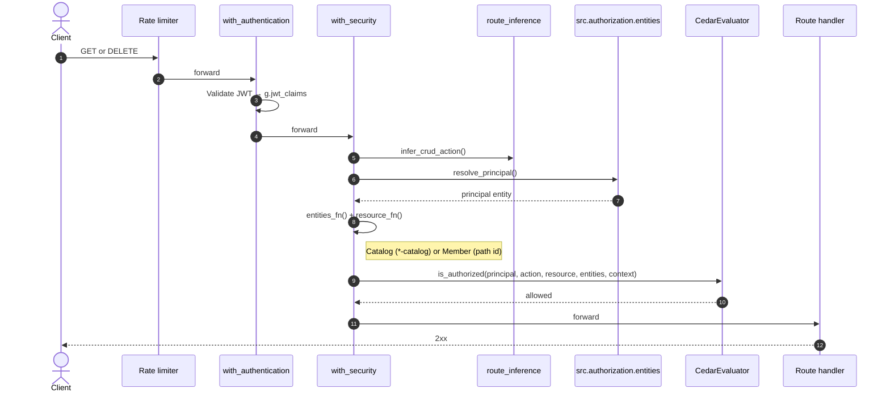
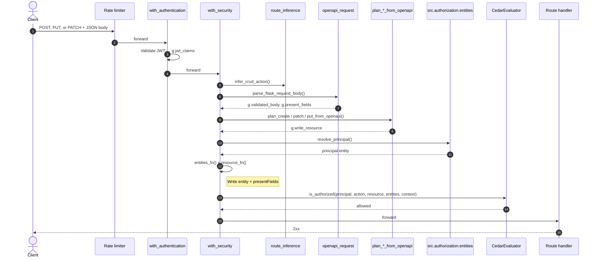

# authorization-in-the-middle

Shared Cedar authorization middleware for Neosofia platform services.

**Jump to:** [Quick ref — vanilla to custom](#quick-ref--vanilla-to-custom) · [Request flow](#request-flow-with_security) · [Cedar attr detail](#cedar-helpers--what-policies-can-use)

## Rosetta stone — REST, Cedar, and our words

Maps how we talk about APIs to what Cedar evaluates. Read top to bottom once; use the route table as the cheat sheet afterward.

### The authorization question

Every protected route answers one question:

```text
principal  +  action  +  resource
   who         what      on what
```

- **Principal** — who is acting. Almost always JWT **`sub`**, built in `resolve_principal()` (your service decides how: JWT claims, DB row, etc.). Not taken from the path.
- **Action** — what they want, e.g. `Action::"user:list"`. Inferred from HTTP method + path, or passed explicitly on `@with_security`.
- **Resource** — what they act on: one `User`, the `UserCatalog` for “list users,” a `Service`, etc.

Policies only see those three UIDs plus **entity records** (attributes for principal and resource). They do not see HTTP or JWT directly.

### Glossary

| Term | Meaning |
|------|---------|
| **Principal** | The actor (`users::User` / `authentication::User`). |
| **Action** | The verb (`user:read`, `user:list`, …). |
| **Resource** | The target of the action (`User`, `UserCatalog`, `Service`, …). |
| **Entity** | [Cedar](https://docs.cedarpolicy.com/overview/terminology.html) name for a typed object with an id and **attributes** (`uid`, `attrs`, `parents`). In our code: the JSON from `build_entity_payload()`. |
| **Member** | One record — id from the path (`user_uuid`, `slug`). |
| **Catalog** | REST **collection** (list/create) — Cedar type `*Catalog`, fixed id (`user-catalog`). Same as “the list endpoint,” not a product catalog. |

`entities_fn` returns **`[principal_entity, resource_entity]`** — attribute data for who and what. The action is separate.

### Cedar entity record (brief)

UID in policies: `users::User::"aaa-111"` (type + id).

Record passed to the evaluator ([syntax](https://docs.cedarpolicy.com/auth/entities-syntax.html)):

```json
{
  "uid": { "__entity": { "type": "users::User", "id": "aaa-111" } },
  "attrs": { "uuid": "aaa-111", "tenantId": "tenant-xyz", "isOperator": true },
  "parents": []
}
```

“Entity” in code means this object — principal and resource each get one; the action does not.

### REST routes → Cedar

Principal on every row = JWT **`sub`**.

| You say | Example HTTP | Cedar **action** | Cedar **resource** | Resource entity id |
|---------|--------------|------------------|-------------------|-------------------|
| **List** users (paginate, search) | `GET /api/v1/users` | `user:list` | `users::UserCatalog` | Fixed `user-catalog` |
| **Create** a user | `POST /api/v1/users` | `user:create` | `users::UserCatalog` | Fixed `user-catalog` |
| **Get** one user | `GET /api/v1/users/{user_uuid}` | `user:read` | `users::User` | Path `user_uuid` |
| **Replace** one user (full body) | `PUT /api/v1/users/{user_uuid}` | `user:update` | `users::User` | Path `user_uuid` |
| **Update** one user (partial) | `PATCH /api/v1/users/{user_uuid}` | `user:update` | `users::User` | Path `user_uuid` |
| **Delete** one user | `DELETE /api/v1/users/{user_uuid}` | `user:delete` | `users::User` | Path `user_uuid` |
| **Get** a user’s audit history | `GET /api/v1/users/{user_uuid}/audits` | `user:read` | `users::User` | Path `user_uuid` |
| **List** role picklists | `GET /api/v1/roles` | `role:list` | `users::RoleCatalog` | Fixed `role-catalog` |
| **Rotate** a service credential | `POST /api/services/{slug}/rotate` | `service:rotate` | `authentication::Service` | Path `slug` |

**Notes:** List/create target **`UserCatalog`** because the URL has no member id. **PUT** and **PATCH** often share `user:update`. **DELETE** is the usual REST shape — add `user:delete` to policy when you ship it (not on user v1).

Example — list users:

```text
principal  = users::User::"aaa-111"                 ← JWT sub
action     = Action::"user:list"
resource   = users::UserCatalog::"user-catalog"
```

### Request flow (`@with_security`)

Decorator order (outer → inner): rate limiter → `with_authentication` → `with_security` → your handler.

Authn lives in `authentication-in-the-middle`; entity assembly and Cedar evaluation are this package plus your `src.authorization.entities` and policies.

#### GET and DELETE

`infer_crud_action()`: collection path → `:list` · path id on `GET` → `:read` · path id on `DELETE` → `:delete`.



#### POST, PUT, and PATCH

`infer_crud_action()`: `POST` → `:create` · `PUT` / `PATCH` → `:update`.



Cedar **deny** → 403 · evaluator **error** → 503. Writes may also return **400** if OpenAPI validation or `plan_*_from_openapi()` fails (before Cedar).

**Custom actions** (e.g. `service:rotate`, `user:provision`): pass `action=` and usually `entities_fn` / `resource_fn`; use `validate_openapi=True` when the route still accepts JSON.

## Quick ref — vanilla to custom

Policies speak **principal + action + resource** — not HTTP. Your job when wiring a route is to make sure the SDK assembles entity attrs that match what the Cedar policy already expects. Start at Level 0; climb only when inference cannot produce those attrs or UIDs.

Pick the **lowest level** that fits your route. Each step adds only what inference cannot supply.

| Level | When | You write | SDK infers / synthesizes |
|-------|------|-----------|--------------------------|
| **0** | Standard REST CRUD matches policy vocabulary | `entities.py` + bare `@with_security()` | action, catalog vs member, entities, OpenAPI writes |
| **1** | Same, but tune limits or path id name | + `rate_limit`, `id_arg`, `resource_loader` | everything else |
| **2** | Nested collection (tenant-scoped list) | nothing extra if path matches convention | `catalog_id_from`, `catalog_attrs` (e.g. `/tenants/<tenant_uuid>/users`) |
| **3** | Non-CRUD action on catalog or member | + `action=`, `resource_type` + `catalog_id` or `id_arg` | member/catalog UID where possible |
| **4** | Catalog attrs need DB / query / service logic | + `build_*_catalog_resource()` or `catalog_attrs=` | principal, action, catalog id |
| **5** | Action + entities do not map to REST layout | + `entities_fn`, `resource_fn` | JWT auth, Cedar eval, logging |
| **6** | Full manual control | `with_authorization` + `CedarEvaluator` | nothing |

---

### Level 0 — Standard CRUD (start here)

**When:** Your route is ordinary REST and your Cedar policy already uses inferred actions (`user:read`, `user:list`, …) on `users::User` or `users::UserCatalog`.

**What Cedar sees** on `GET /api/v1/users/{user_uuid}`:

```text
principal  = users::User::"{JWT sub}"
action     = Action::"user:read"
resource   = users::User::"{user_uuid}"
resource.tenantId, resource.roles  ← from registry_user_cedar_attrs + path id
```

**Policy** (self-read; member attrs must include `uuid` and `tenantId`):

```cedar
permit (
    principal is users::User,
    action in [Action::"user:read", Action::"user:update"],
    resource is users::User
) when {
    principal.uuid == resource.uuid
};
```

**Policy** (PATCH field allowlist — SDK attaches `presentFields` on writes):

```cedar
forbid (
    principal is users::User,
    action == Action::"user:update",
    resource is users::User
) when {
    principal.uuid == resource.uuid &&
    !principal.isOperator &&
    resource.presentFields.contains("roles")
};
```

**Code** — wire the policy above in three places. The SDK cannot infer who the principal is or which DB fields become Cedar attrs — that lives in `entities.py`. Service planners answer what row Cedar judges on writes. Route decorators opt endpoints into the pipeline; leave them bare until a later level needs more.

| File | You provide |
|------|-------------|
| `src/authorization/entities.py` | `NAMESPACE`, `resolve_principal()`, `registry_{model}_cedar_attrs` |
| `src/services/{model}_service.py` | `plan_patch_from_openapi`, … (writes that merge onto stored rows); optional `plan_create_from_openapi` when create needs normalization beyond OpenAPI |
| Route module | `@with_security()` — no `action` / `entities_fn` overrides yet |

Start in `entities.py`. The SDK calls `resolve_principal()` on every request and `registry_user_cedar_attrs` when it builds member/write entities — map Python field names to what the policy references (`tenant_uuid` → `tenantId`):

```python
from authorization_in_the_middle.flask_identity import resolve_jwt_principal

NAMESPACE = "users"

def registry_user_cedar_attrs(row: dict) -> dict:
    return {
        "uuid": str(row.get("uuid") or ""),
        "tenantId": str(row.get("tenant_uuid") or ""),
        "roles": list(row.get("roles") or []),
    }

def resolve_principal() -> dict:
    return resolve_jwt_principal(NAMESPACE)  # add actor_classes= when tier-1 flags needed
```

On POST, PUT, and PATCH, Cedar evaluates the **planned** row — validated JSON merged onto the stored record for updates, or validated JSON (plus path scope on nested creates) for POST. Custom planners are required when policy inspects normalized fields the SDK cannot infer (roles, UUID placeholders, DB merge on PATCH):

```python
def plan_create_from_openapi() -> dict: ...  # optional for POST; SDK default when omitted
def plan_patch_from_openapi() -> dict: ...  # required for PATCH when Cedar judges merged member attrs
```

Protect routes with bare `@with_security()`; inference supplies action and entity UIDs from method + path. Handlers use `g.write_resource` on create/update and `g.validated_body` / `g.patch_body` after Cedar allows:

```python
@bp.route("", methods=["GET"])
@with_security(rate_limit="60 per minute")
def list_users(): ...

@bp.route("/<user_uuid>", methods=["GET", "PATCH"])
@with_security(rate_limit="60 per minute")
def get_or_patch_user(user_uuid: str): ...
```

---

### Level 1 — Route parameters only

**When:** Level 0 inference is almost right — you need a different path param name, richer member attrs from the DB, or a stricter rate limit. The policy vocabulary stays the same.

**Example — tenant read** (`GET /api/v1/tenants/{tenant_uuid}`). Policy compares session tenant to resource tenant; member attrs need `tenantId` from the path param (via `registry_tenant_cedar_attrs`):

```cedar
permit (
    principal is authentication::User,
    action == Action::"tenant:read",
    resource is authentication::Tenant
) when {
    principal.isOperator || principal.tenantId == resource.tenantId
};
```

**Code** — keep the Level 0 `entities.py`; the policy vocabulary is already right. Tune `@with_security` only where inference would pick the wrong id or attrs.

For `GET /tenants/{tenant_uuid}` the path param matches convention — inference maps it to `resource.tenantId` via `registry_tenant_cedar_attrs`. A stricter rate limit is often the only change:

```python
@with_security(rate_limit="120 per minute")
def get_tenant(tenant_uuid: str): ...
```

When the path key is not `{model}_uuid` (e.g. `slug` on services), point member synthesis at the right arg — otherwise attrs default to a `uuid` row key:

```python
@with_security(id_arg="slug")
def get_service(slug: str): ...
```

If the policy needs attrs that exist only on the DB row (roles, tenant), load the row before Cedar so `registry_*_cedar_attrs` sees the full record:

```python
@with_security(resource_loader=lambda user_uuid: user_service.get_user_or_404(user_uuid))
def get_user(user_uuid: str): ...
```

| Parameter | Use when |
|-----------|----------|
| `rate_limit` | Per-route throttle (default `60 per minute`) |
| `id_arg` | Path param is not `{model}_uuid` (e.g. `slug`) |
| `resource_loader` | Member attrs should include fields from a DB row at authz time |
| `enforce_active_actor=False` | Machine callers without `X-Active-Actor` (e.g. service provision) |

---

### Level 2 — Nested collection (tenant-scoped list)

**When:** List/create is scoped by a parent id in the path, e.g. `GET /api/v1/tenants/{tenant_uuid}/users`. The policy checks `resource.tenantId` on the **catalog** entity, not on each member row.

**What Cedar sees:**

```text
action     = Action::"user:list"
resource   = users::UserCatalog::"user-catalog"
resource.tenantId  ← from path tenant_uuid (inferred catalog_attrs)
```

**Policy:**

```cedar
permit (
    principal is users::User,
    action == Action::"user:list",
    resource is users::UserCatalog
) when {
    principal.isClinician &&
    resource has tenantId &&
    principal.tenantId == resource.tenantId
};
```

**Code** — nested paths like `/tenants/<tenant_uuid>/users` copy the parent id onto the catalog entity automatically. No new files if the path matches convention:

```python
@bp.route("/<tenant_uuid>/users", methods=["GET"])
@with_security(rate_limit=settings.user_read_rate_limit)
def list_tenant_users(tenant_uuid: str): ...
```

If inference picks the wrong param or Cedar attr name, override — but prefer fixing the route shape first:

```python
@with_security(catalog_id_from="site_uuid", catalog_attrs={"tenantId": "..."})
```

---

### Level 3 — Custom Cedar action

**When:** The HTTP verb and path noun do not map cleanly to `:list` / `:read` / `:create` / `:update` / `:delete` — e.g. `PUT …/provision`, `POST …/rotate`, `GET …/audits` on a catalog.

**Example — service provision** (`PUT /api/v1/users/{user_uuid}` with `user:provision` on a fixed singleton):

```cedar
permit (
    principal is users::Service,
    action == Action::"user:provision",
    resource is users::UserProvisioning
) when {
    principal.tokenType == "service" && principal.serviceSlug == "authentication"
};
```

**Code** — inference cannot derive verbs like `user:provision` or `service:rotate` from HTTP alone. Name the Cedar action (and resource type when it is not `{Model}` / `{Model}Catalog`) on the decorator.

Service provision — fixed singleton, OpenAPI body, service JWT without active actor:

```python
@with_security(
    action='Action::"user:provision"',
    resource_type="UserProvisioning",
    catalog_id="user-provisioning",
    enforce_active_actor=False,
    validate_openapi=True,
)
def provision_user(user_uuid: str):
    payload = g.validated_body
    ...
```

**Example — credential rotate** (`POST /api/services/{slug}/rotate`):

```cedar
permit (
    principal is authentication::User,
    action == Action::"service:rotate",
    resource is authentication::Service
) when { principal.isOperator };
```

Same member resource type as a normal read, but a custom action and `slug` instead of `uuid`:

```python
@with_security(action='Action::"service:rotate"', id_arg="slug")
def rotate_service(slug: str): ...
```

Custom list verb on an otherwise normal catalog path — often only `action=` is needed:

```python
@with_security(action='Action::"service:audit:list"')  # GET /api/services/audits
def list_catalog_audits(): ...
```

---

### Level 4 — Custom catalog attributes

**When:** The policy needs attrs on a catalog that inference cannot derive from the path alone — e.g. `userUuid` from path **or** query, and `tenantId` resolved from DB or service context.

**What Cedar sees** on `GET /api/v1/users/{user_uuid}/interactions`:

```text
action     = Action::"interaction:list"
resource   = chat::ChatCatalog::"chat-catalog"
resource.userUuid  ← from path
resource.tenantId  ← from DB / CE context (your builder)
```

**Policy:**

```cedar
permit (
    principal is chat::User,
    action in [Action::"interaction:list", Action::"interaction:create"],
    resource is chat::ChatCatalog
) when {
    principal.actors.contains("clinician") &&
    principal.tenantId == resource.tenantId &&
    principal.tenantId != ""
};
```

**Code** — the policy needs `tenantId` (and sometimes `userUuid`) on the catalog, but those values come from DB, query, or service context — not the path alone. Put that logic in `entities.py`; `with_security` discovers `build_*_catalog_resource` by naming convention and keeps route decorators thin:

```python
from authorization_in_the_middle import request_scoped_uuid
from authorization_in_the_middle.entities import build_entity_payload

def build_chat_catalog_resource() -> dict:
    attrs = {}
    if user_uuid := request_scoped_uuid("user_uuid"):
        attrs["userUuid"] = user_uuid
        if tenant := _tenant_for(user_uuid):
            attrs["tenantId"] = tenant
    return build_entity_payload(f"{NAMESPACE}::ChatCatalog", "chat-catalog", attrs)
```

When attrs are a one-liner from path args, `catalog_attrs=` on the route is enough — same effect, less ceremony:

```python
@with_security(
    action='Action::"message:list"',
    resource_type="ChatCatalog",
    catalog_id="chat-catalog",
    catalog_attrs=lambda: {"userUuid": request.view_args["user_uuid"]},
)
```

| Helper | Use when |
|--------|----------|
| `request_scoped_uuid("user_uuid")` | Scope from path → query → body → principal self |
| `build_catalog_entity` / `build_entity_payload` | Assemble catalog entity dict |
| `catalog_attrs=` / `catalog_id_from=` | Override inferred nested scope |

---

### Level 5 — Custom entity pairs

**When:** The resource is not a REST member or catalog at all — synthetic types, compound paths, or layouts inference will never guess.

**Example — IdP observability** (`GET /api/idp/failed-authentications`). Resource type does not follow `{Model}` / `{Model}Catalog`:

```cedar
permit (
    principal is authentication::User,
    action == Action::"idp:failed_auth:read",
    resource is authentication::IdpObservability
) when {
    principal.isOperator
};
```

**Code** — supply the full `[principal, resource]` pair yourself. The route names `action` and points at two hooks in `entities.py` that must agree with the policy UIDs:

```python
@with_security(
    action='Action::"idp:failed_auth:read"',
    entities_fn=auth_entities.idp_observability_entities,
    resource_fn=auth_entities.idp_observability_resource_uid,
)
def list_failed_authentications(): ...
```

```python
def idp_observability_entities() -> list[dict]:
    return [
        resolve_principal(),
        build_entity_payload(f"{NAMESPACE}::IdpObservability", "idp-observability", {}),
    ]

def idp_observability_resource_uid() -> str:
    return entity_uid(f"{NAMESPACE}::IdpObservability", "idp-observability")
```

---

### Level 6 — `with_authorization` (escape hatch)

**When:** You are not using REST inference at all — legacy routes, prototypes, or policies that do not follow platform conventions. You supply every UID and entity record yourself.

**Policy** is unchanged; only the wiring moves into explicit callables:

```cedar
permit (
    principal is cdp::User,
    action == Action::"document:read",
    resource is cdp::PatientRecord
) when {
    principal.tenantId == resource.tenantId
};
```

**Code** — drop `@with_security` and pass every UID yourself. No inference, OpenAPI write pipeline, or convention discovery — climb back to Level 0–5 when the route shape allows:

```python
from authorization_in_the_middle import CedarEvaluator, with_authorization

@app.route("/patients/<patient_id>")
@with_authorization(
    _evaluator,
    principal_fn=lambda: extract_jwt_principal_uid("cdp"),
    action='Action::"document:read"',
    resource_fn=lambda: f'cdp::PatientRecord::"{request.view_args["patient_id"]}"',
    entities_fn=lambda: [resolve_principal(), build_resource(...)],
)
def get_patient(patient_id): ...
```
